# MySchool Checks
### Αυτοματοποιημένοι Έλεγχοι Δεδομένων MySchool
**Διεύθυνση Π.Ε. Ανατολικής Θεσσαλονίκης**

| | |
|---|---|
| **Υπεύθυνος** | Μιχάλης Κατσιρντάκης |
| **Τηλέφωνο** | 2310 954145 |
| **Email** | itdipea@sch.gr |
| **Έκδοση** | 1.0 — Απρίλιος 2026 |

---

### 💙 Αν το βρήκες χρήσιμο, δώσε ένα ⭐ Star στο repository!

---

## Πίνακας Περιεχομένων

- [Τι είναι](#τι-είναι)
- [Εγκατάσταση — Μόνο την Πρώτη Φορά](#εγκατάσταση--μόνο-την-πρώτη-φορά)
  - [Βήμα 1 — Python](#βήμα-1--python)
  - [Βήμα 2 — Google Chrome](#βήμα-2--google-chrome)
  - [Βήμα 3 — ChromeDriver](#βήμα-3--chromedriver)
  - [Βήμα 4 — Βιβλιοθήκες Python](#βήμα-4--βιβλιοθήκες-python)
  - [Βήμα 5 — Ρυθμίσεις](#βήμα-5--ρυθμίσεις)
- [Αυτόματη Λήψη Αρχείων](#αυτόματη-λήψη-αρχείων)
- [Καθημερινή Χρήση](#καθημερινή-χρήση)
- [Οδηγός Ελέγχων](#οδηγός-ελέγχων)
- [Αντιμετώπιση Προβλημάτων](#αντιμετώπιση-προβλημάτων)
- [Screenshots](#screenshots)

---

## Τι είναι

Το **MySchool Checks** είναι εφαρμογή Windows που αυτοματοποιεί ελέγχους δεδομένων εκπαιδευτικών στο MySchool. Κατεβάζει αρχεία αυτόματα μέσω Chrome, επεξεργάζεται CSV/Excel με pandas, παράγει μορφοποιημένα αποτελέσματα και αποστέλλει emails στα σχολεία.

Δεν απαιτείται εμπειρία προγραμματισμού. Ξεκινά με διπλό κλικ στο `start.bat` — την **πρώτη φορά μόνο**. Κατά την πρώτη εκτέλεση δημιουργείται αυτόματα **συντόμευση στην επιφάνεια εργασίας** (MySchool Checks), οπότε από εκεί και πέρα δεν χρειάζεται το `start.bat`.

---

## Εγκατάσταση — Μόνο την Πρώτη Φορά

### Βήμα 1 — Python

1. Πήγαινε στο https://www.python.org/downloads/ και κατέβασε την τελευταία Python 3
2. Τρέξε το installer. **Σημαντικό:** τσέκαρε **"Add Python to PATH"** πριν πατήσεις Install
3. Επαλήθευση: `Win+R` → `cmd` → `python --version` → πρέπει να εμφανιστεί `Python 3.x.x`

### Βήμα 2 — Google Chrome

Το πρόγραμμα χρησιμοποιεί τον **Google Chrome** για αυτόματη λήψη αρχείων.

- Αν δεν έχεις Chrome: https://www.google.com/chrome/
- Αν έχεις Chrome, **βεβαιώσου ότι είναι ενημερωμένος** (⋮ → Βοήθεια → Σχετικά με τον Google Chrome)

### Βήμα 3 — ChromeDriver

Το ChromeDriver επιτρέπει στο πρόγραμμα να ελέγχει τον Chrome. Πρέπει να ταιριάζει με την έκδοση του Chrome σου.

**Αυτόματα (συνιστάται):**
Αν η μηχανή σου έχει σύνδεση internet, το πρόγραμμα κατεβάζει αυτόματα τον κατάλληλο driver. Δεν χρειάζεται κάτι επιπλέον.

**Χειροκίνητα (αν το αυτόματο αποτύχει):**
1. Δες την έκδοση Chrome σου: `⋮ → Βοήθεια → Σχετικά` (π.χ. `124.0.6367.82`)
2. Πήγαινε στο: https://googlechromelabs.github.io/chrome-for-testing/
3. Βρες την ίδια (ή πιο κοντινή) έκδοση, κατέβασε `chromedriver` → `win64`
4. Αποσυμπίεσε και τοποθέτησε το `chromedriver.exe` στον φάκελο:
   ```
   MySchoolChecks\drivers\chromedriver-win64\chromedriver.exe
   ```

> Αν αποτύχει και το χειροκίνητο, το πρόγραμμα εμφανίζει αναλυτικό μήνυμα με τον ακριβή σύνδεσμο λήψης για την έκδοση Chrome που έχεις.

### Βήμα 4 — Βιβλιοθήκες Python

Άνοιξε `cmd` και εκτέλεσε:

```
pip install pandas openpyxl selenium xlrd python-dateutil html2text
```

> Αυτό γίνεται **αυτόματα** την πρώτη φορά που τρέχεις το `start.bat`. Το χειροκίνητο βήμα χρειάζεται μόνο αν το αυτόματο αποτύχει.

### Βήμα 5 — Ρυθμίσεις

1. Διπλό κλικ στο `start.bat`
2. Κλικ **⚙ Ρυθμίσεις**

| Καρτέλα | Τι συμπληρώνεις |
|---|---|
| **Σύνδεση** | Username & κωδικός MySchool (SSO) + κωδικός email αποστολής |
| **Email** | Εμφανιζόμενο όνομα, email αποστολής, SMTP host, κείμενο υπογραφής |
| **Αρχεία** | Αρχείο Αδυνατούντων υπό έγκριση *(προαιρετικό — μόνο για τον έλεγχο Υπολοίπων)* |

3. Κλικ **Αποθήκευση** — τα στοιχεία αποθηκεύονται τοπικά και δεν ανεβαίνουν στο GitHub

---

## Αυτόματη Λήψη Αρχείων

- Κλικ **⬇ Λήψη Δεδομένων** στο κύριο παράθυρο
- Επίλεξε τα αρχεία που θέλεις — αρχεία που υπάρχουν ήδη από σήμερα εμφανίζονται με ✓
- Ο Chrome ανοίγει αυτόματα, συνδέεται στο MySchool και κατεβάζει τα αρχεία

| Κωδικός | Ονομασία |
|---|---|
| 4.8 | Ωράριο εκπαιδευτικών |
| 4.9 | Παρόντες εκπαιδευτικοί |
| 4.11 | Μείωση ωραρίου |
| 4.12 | Συμπλήρωση ωραρίου |
| 4.20 | Άδειες Άνευ Αποδοχών |
| 4.21 | Άδειες (πλην ΑΑ) |
| 8.2 | Επιβεβαίωση δεδομένων |
| Αδυνατούντες ανά ειδικότητα | Κατεβαίνει απευθείας |

Τα αρχεία αποθηκεύονται σε `downloads/YYYYMMDD/`. Αρχεία που υπάρχουν ήδη από σήμερα παραλείπονται. Μετά από κάθε λήψη διατηρείται μόνο ο τελευταίος φάκελος — οι παλαιότεροι διαγράφονται αυτόματα.

Αν δεν μπορείς να χρησιμοποιήσεις την αυτόματη λήψη, κάθε έλεγχος επιτρέπει χειροκίνητη επιλογή αρχείου.

---

## Καθημερινή Χρήση

1. Διπλό κλικ στη **συντόμευση MySchool Checks** (ή στο `start.bat` αν δεν έχει δημιουργηθεί ακόμα)
2. *(Προαιρετικά)* **⬇ Λήψη Δεδομένων** για να ενημερωθούν τα αρχεία
3. Επίλεξε έναν ή περισσότερους ελέγχους — **Όλοι** επιλέγει όλους
4. Κλικ **▶ Εκκίνηση ελέγχου**

### Επιλογή αποστολής email

| Επιλογή | Τι κάνει |
|---|---|
| **Χωρίς αποστολή** | Δημιουργεί μόνο το συνολικό αρχείο Excel |
| **Test mode** | Στέλνει το συνολικό αρχείο στο email αποστολής για έλεγχο |
| **Κανονική αποστολή** | Ένα αρχείο + email ανά σχολείο |

> Ξεκίνα πάντα με **Test mode** για να ελέγξεις τα αποτελέσματα πριν κάνεις κανονική αποστολή.

Όταν επιλέγεις πολλαπλούς ελέγχους, εκτελούνται διαδοχικά. Στο τέλος εμφανίζεται παράθυρο πλοήγησης αποτελεσμάτων με ◀ / ▶.

---

## Οδηγός Ελέγχων

### 1 · Επιβεβαίωση Δεδομένων Σχολείων
Σχολεία που δεν έχουν ολοκληρώσει επιβεβαίωση δεδομένων πριν από ημερομηνία που ορίζεις.
**Αρχείο:** 8.2 (xls / xlsx) · **Email:** ένα ανά σχολείο

### 2 · Διαφορές AK-AL
Εκπαιδευτικοί όπου το υποχρεωτικό ωράριο (AK) διαφέρει από το άθροισμα ωρών στους φορείς (AL).
**Αρχείο:** 4.9 (csv / xlsx) · **Email:** test mode μόνο

### 3 · Αρνητικά Υπόλοιπα Ωραρίου
Εκπαιδευτικοί με αναθέσεις περισσότερες από το διδακτικό τους ωράριο.
**Αρχείο:** 4.8 (csv / xlsx) · **Email:** ένα ανά σχολείο

### 4 · Σύγκριση Αδειών Άνευ Αποδοχών & Παρόντων
Εκπαιδευτικοί παρόντες στο 4.9 ενώ βρίσκονται σε άδεια άνευ αποδοχών (>10 ημέρες).
**Αρχεία:** 4.20 + 4.9 (csv) · **Email:** test mode μόνο

### 5 · Σύγκριση Αδειών (πλην ΑΑ) & Παρόντων
Εκπαιδευτικοί παρόντες στο 4.9 ενώ βρίσκονται σε μακροχρόνια άδεια (>10 ημέρες).
**Αρχεία:** 4.21 + 4.9 (csv) · **Email:** ένα ανά σχολείο

### 6 · Ελλιπή Στοιχεία Πράξης Ανάληψης
Εκπαιδευτικοί χωρίς Ημερομηνία Ανάληψης σε ενεργή τοποθέτηση.
**Αρχείο:** 4.8 (csv / xlsx) · **Email:** ένα ανά σχολείο

### 7 · Έλεγχος Καταχωρήσεων Διοικητικού Έργου
Γραμματειακή Υποστήριξη στο 4.12 — σύγκριση με ΠΔΕ απόφαση και αρχείο Αδυνατούντων. Παράγει 2 φύλλα Excel.
**Αρχεία:** 4.12 (csv) + Αδυνατούντες ανά ειδικότητα · **Email:** test mode μόνο

### 8 · Υπόλοιπα Ωραρίου
Υπόλοιπα ωραρίου εκπαιδευτικών με κατώφλι που ορίζεις. Παράγει συνολικό αρχείο + pivot αναφορά (5 φύλλα).
**Αρχεία:** 4.8 + 4.12 + 4.11 (csv) + Αδυνατούντες υπό έγκριση *(προαιρετικό)* · **Email:** ένα ανά σχολείο

---

## Αντιμετώπιση Προβλημάτων

| Πρόβλημα | Λύση |
|---|---|
| `"python" is not recognized` | Επανεγκατάσταση Python με **"Add Python to PATH"** τσεκαρισμένο |
| `No module named pandas` | `pip install pandas openpyxl selenium xlrd python-dateutil html2text` |
| Chrome δεν ανοίγει / κλείνει αμέσως | Βεβαιώσου ότι ο Chrome είναι ενημερωμένος και τα στοιχεία SSO στις Ρυθμίσεις είναι σωστά |
| Σφάλμα ChromeDriver | Το πρόγραμμα εμφανίζει αναλυτικές οδηγίες με τον ακριβή σύνδεσμο λήψης για την έκδοση Chrome σου — ακολούθησέ τες (βλ. Βήμα 3 παραπάνω) |
| Λανθασμένα στοιχεία σύνδεσης | Έλεγξε username/κωδικό MySchool στις Ρυθμίσεις → Σύνδεση |
| Αδυνατούντες δεν κατεβαίνουν | Δοκίμασε ξανά τη Λήψη — αν αποτύχει, κατέβασέ το χειροκίνητα από το MySchool |
| Δεν ανοίγει παράθυρο επιλογής αρχείου | Κοίτα αν υπάρχει κρυμμένο παράθυρο στη γραμμή εργασιών |
| Σφάλμα αποστολής email | Έλεγξε κωδικό email στις Ρυθμίσεις. Δοκίμασε πρώτα Test Mode |
| Κενά αποτελέσματα | Έλεγξε ημερομηνία ελέγχου και ότι επέλεξες το σωστό αρχείο |

---

*Επικοινωνία: Μιχάλης Κατσιρντάκης — 2310 954145 — itdipea@sch.gr*
*Δ/νση Π.Ε. Ανατολικής Θεσσαλονίκης*

---

## Screenshots

**Οθόνη έναρξης**

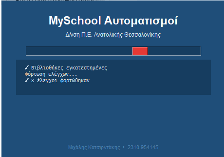

**Κύριο παράθυρο**

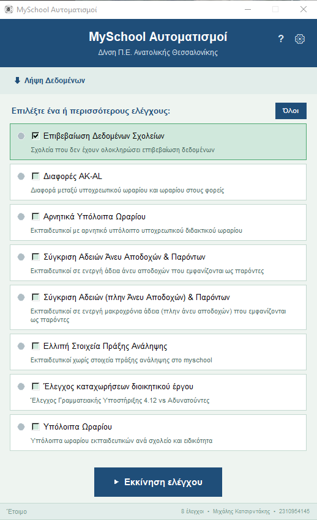

**Ρυθμίσεις — Σύνδεση**

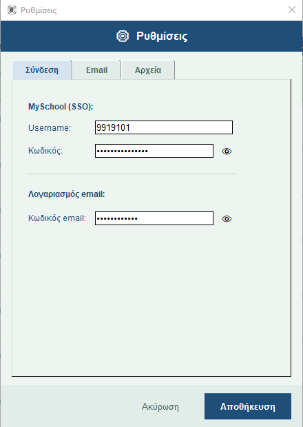

**Ρυθμίσεις — Email**

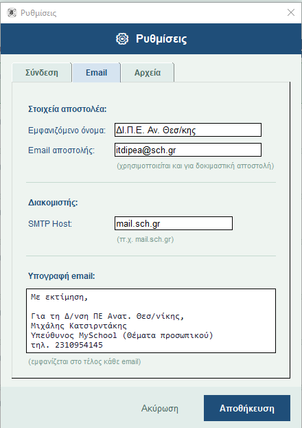

**Ρυθμίσεις — Αρχεία**

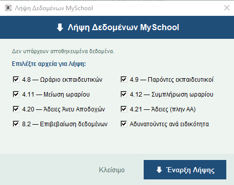

**Μήνυμα σφάλματος ChromeDriver** — εμφανίζεται ακριβής σύνδεσμος λήψης για την έκδοση Chrome που έχεις

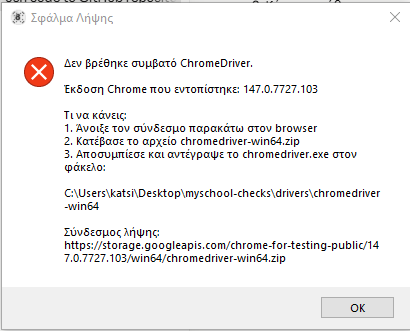

**Λήψη Δεδομένων — Ολοκλήρωση**

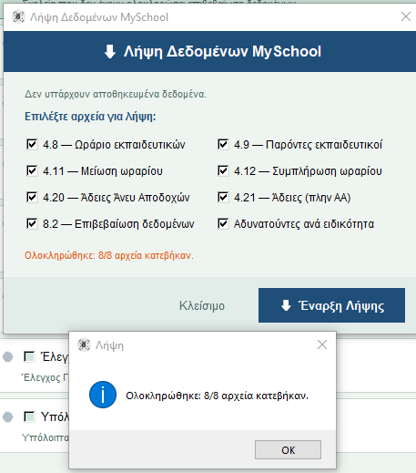

**Παραμετροποίηση ελέγχου** — επιλογή ημερομηνίας cutoff

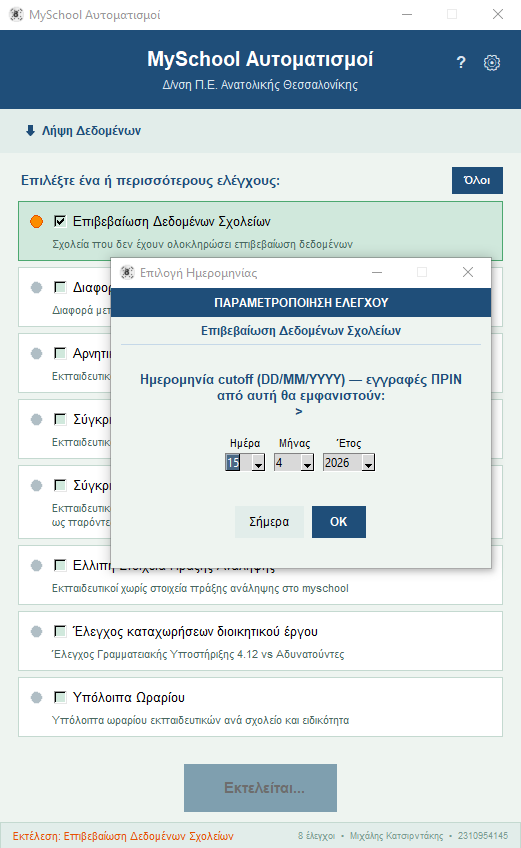

**Επιλογές αποστολής email**

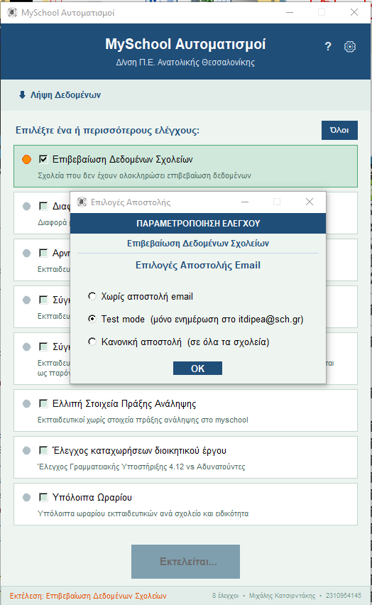

**Αποτελέσματα ελέγχου** — σύνοψη με ευρήματα

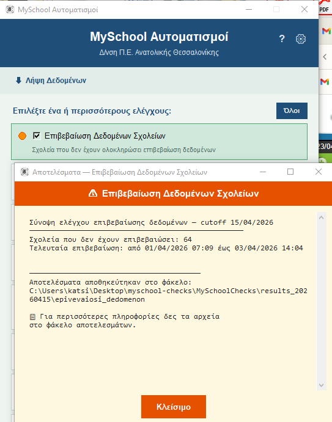

**Αρχείο Excel αποτελεσμάτων**

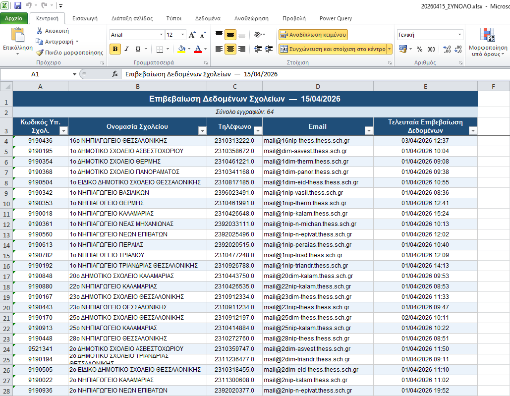

**Αποτελέσματα ελέγχου χωρίς θέματα** — ο έλεγχος ολοκληρώθηκε καθαρά

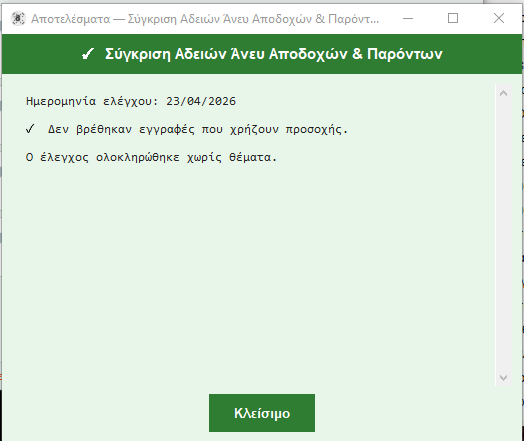

**Test mode** — τα emails φτάνουν στα εισερχόμενά σου πριν από κανονική αποστολή

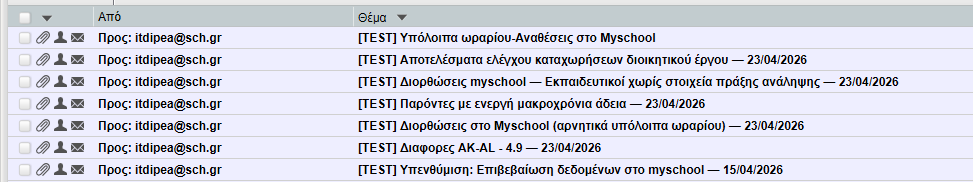
